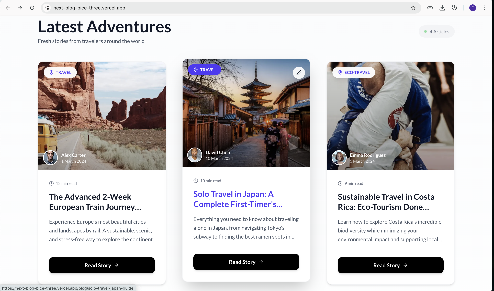
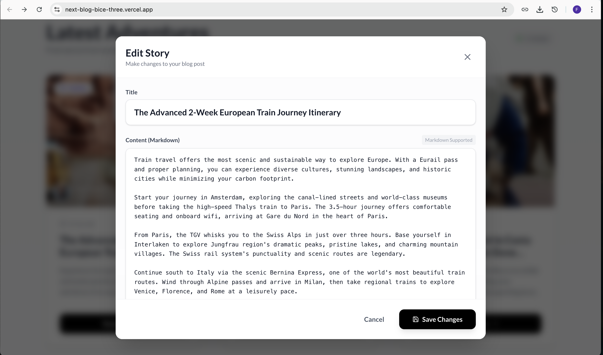

# NextBlog - Modern Travel Blog Platform

NextBlog is a high-performance, accessible, and dynamic travel blog application built with **Next.js 15 (App Router)**, **TypeScript**, and **Tailwind CSS**. It features server-side rendering, static site generation, interactive comments, and a robust design system.

## 📸 Screenshots

<div align="center">
  <h3>Home Page</h3>
  
  
  <h3>Blog Listing</h3>
  

  <h3>Blog Detail</h3>
  

  <h3>Blog Editor</h3>
  
</div>

## 🚀 Features

-   **Modern Tech Stack**: Built with Next.js 15, React 19, and Redux Toolkit.
-   **Performance Optimized**:
    -   Static Site Generation (SSG) for blog posts.
    -   Lazy loading for heavy components (`next/dynamic`).
    -   Image optimization with `next/image`.
    -   Gzip compression enabled.
-   **Accessibility First**:
    -   Semantic HTML structure (`article`, `nav`, `section`).
    -   Full keyboard navigation support.
    -   ARIA labels and roles for screen readers.
    -   High contrast and accessible touch targets.
-   **Interactive Elements**:
    -   Real-time comment system with star ratings.
    -   Dynamic author bio slider.
    -   "Tour Guides" sidebar widget.
    -   Blog post editing capabilities (client-side demo).
-   **Data Management**:
    -   MongoDB integration with Mongoose.
    -   Redux Toolkit Query (RTK Query) for efficient data fetching and caching.
    -   Database seeding script included.

## 🛠️ Tech Stack

-   **Framework**: [Next.js 15](https://nextjs.org/)
-   **Language**: [TypeScript](https://www.typescriptlang.org/)
-   **Styling**: [Tailwind CSS](https://tailwindcss.com/) & CSS Modules
-   **State Management**: [Redux Toolkit](https://redux-toolkit.js.org/)
-   **Database**: [MongoDB](https://www.mongodb.com/) & [Mongoose](https://mongoosejs.com/)
-   **Icons**: [Lucide React](https://lucide.dev/)
-   **Forms**: [Formik](https://formik.org/) & [Yup](https://github.com/jquense/yup)
-   **Notifications**: [React Hot Toast](https://react-hot-toast.com/)

## 🏁 Getting Started

Follow these steps to set up the project locally.

### Prerequisites

-   **Node.js** (v18 or higher)
-   **MongoDB** (Local instance or Atlas URI)

### Installation

1.  **Clone the repository**:
    ```bash
    git clone https://github.com/yourusername/next-blog.git
    cd next-blog
    ```

2.  **Install dependencies**:
    ```bash
    npm install
    ```

3.  **Set up Environment Variables**:
    Create a `.env.local` file in the root directory and add your MongoDB connection string:
    ```env
    MONGODB_URI=mongodb://127.0.0.1:27017/next-blog
    ```

4.  **Seed the Database**:
    Populate your local database with initial data (blogs, comments, tour guides):
    ```bash
    npx tsx scripts/seed.ts
    ```

5.  **Run the Development Server**:
    ```bash
    npm run dev
    ```

    Open [http://localhost:3000](http://localhost:3000) with your browser to see the result.

## 📂 Project Structure

```
├── app/                  # Next.js App Router pages and API routes
│   ├── api/              # Backend API endpoints (blogs, comments, etc.)
│   ├── blog/[slug]/      # Dynamic blog post page (SSG)
│   ├── globals.css       # Global styles and Tailwind directives
│   ├── layout.tsx        # Root layout with providers
│   └── page.tsx          # Home page
├── components/           # Reusable UI components
│   ├── AuthorSlider/     # Author slider component
│   ├── ui/               # Generic UI elements (Button, Input, Skeleton)
│   ├── BlogEditor.tsx    # Blog editing modal
│   └── CommentsSection.tsx # Comments and rating component
├── lib/                  # Utilities and configurations
│   ├── features/         # Redux slices and API definitions
│   ├── mongodb.ts        # Database connection utility
│   └── store.ts          # Redux store configuration
├── models/               # Mongoose data models (Blog, Comment, TourGuide)
├── scripts/              # Utility scripts (e.g., database seeding)
├── types/                # Shared TypeScript interfaces
└── public/               # Static assets
```

## 📜 Scripts

-   `npm run dev`: Starts the development server.
-   `npm run build`: Builds the application for production.
-   `npm start`: Starts the production server.
-   `npm run lint`: Runs ESLint to check for code quality issues.
-   `npx tsx scripts/seed.ts`: Seeds the database with sample data.

## 🤝 Contributing

Contributions are welcome! Please feel free to submit a Pull Request.

## 📄 License

This project is licensed under the MIT License.
